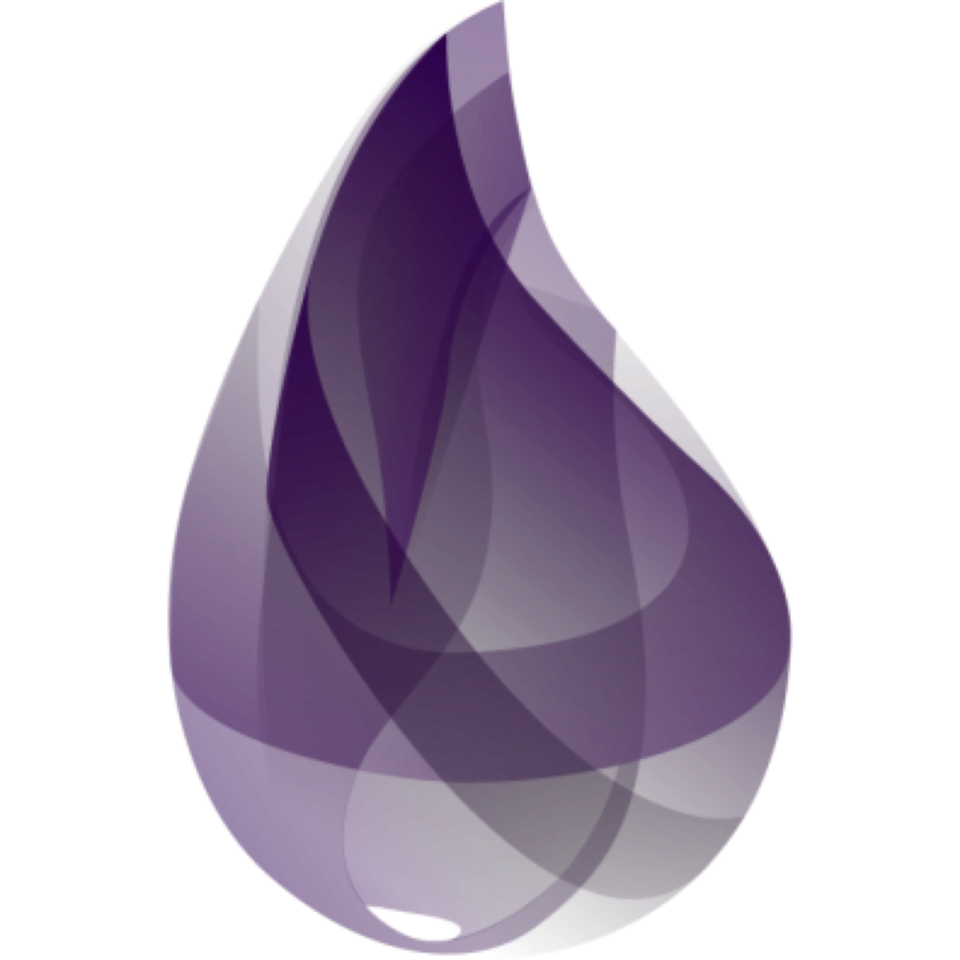

## Hi there, I'm Fabi

I'm currently
- studying computer science at the [University of Stuttgart](https://www.uni-stuttgart.de/en/)
- working at [softwareinmotion](https://www.softwareinmotion.de)

### Languages (Familiar, not necessarily fluent 😅)

- Bash
- Python
- C
- Kotlin / Java
- Golang
- Elixir

   <!-- bash -->
   <!-- Python -->
   <!-- C -->
   <!-- Kotlin -->
   <!-- Java -->
   <!-- golang -->
   <!-- Elixir -->

